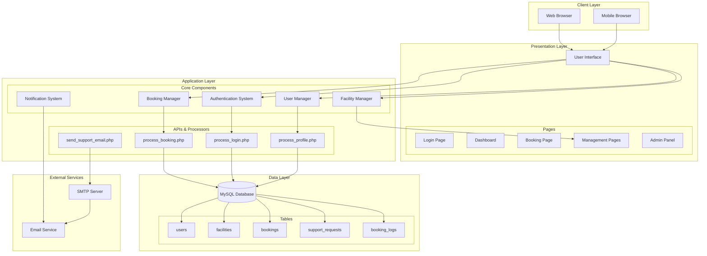
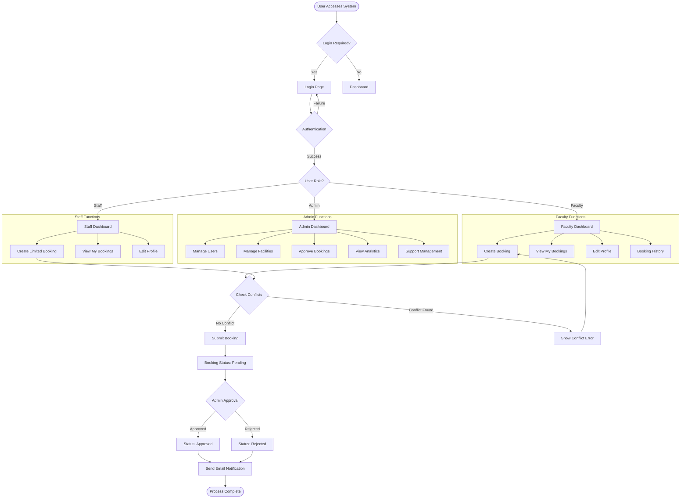
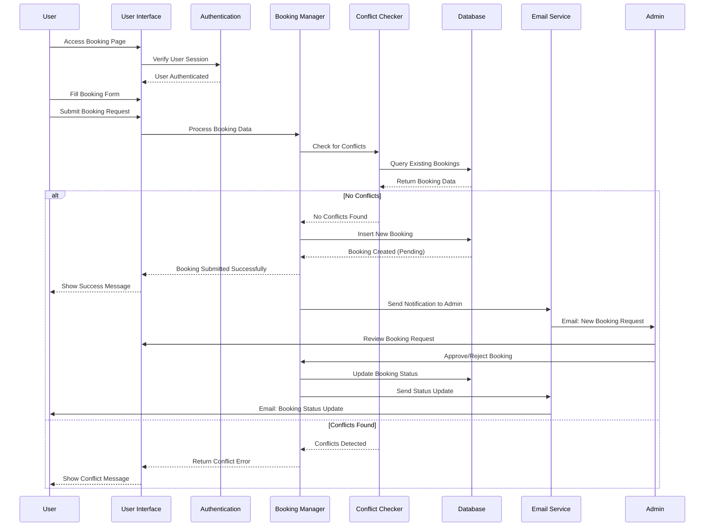
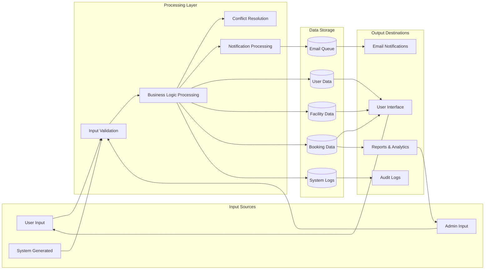
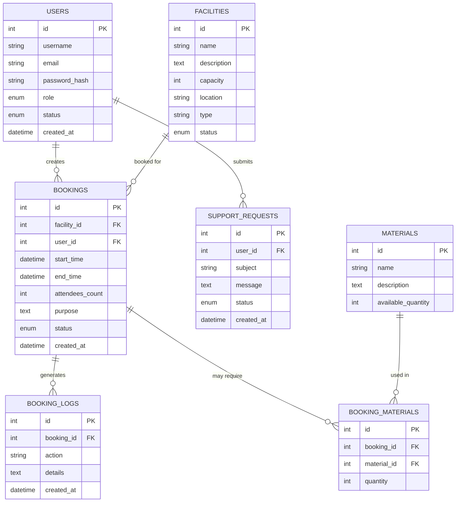
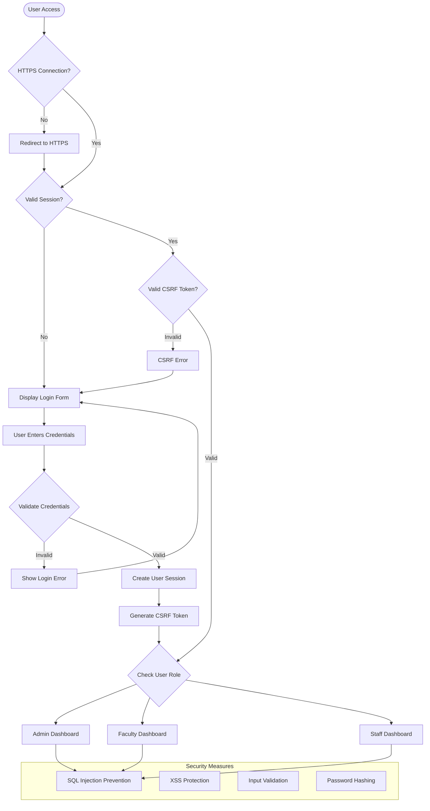
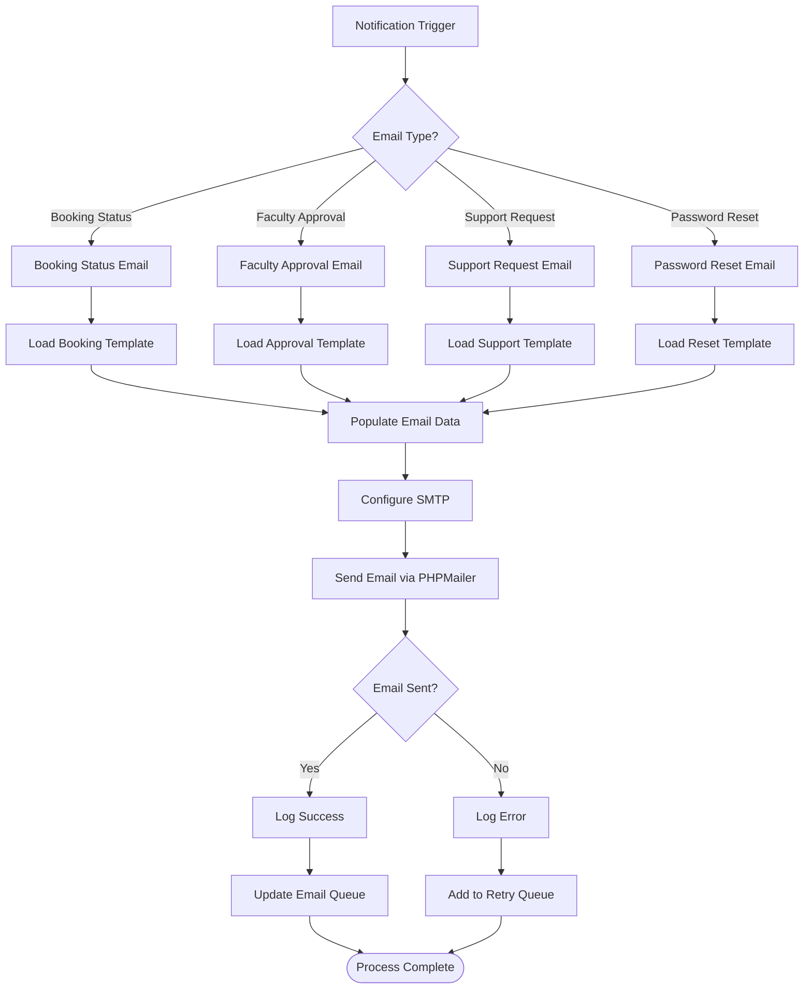
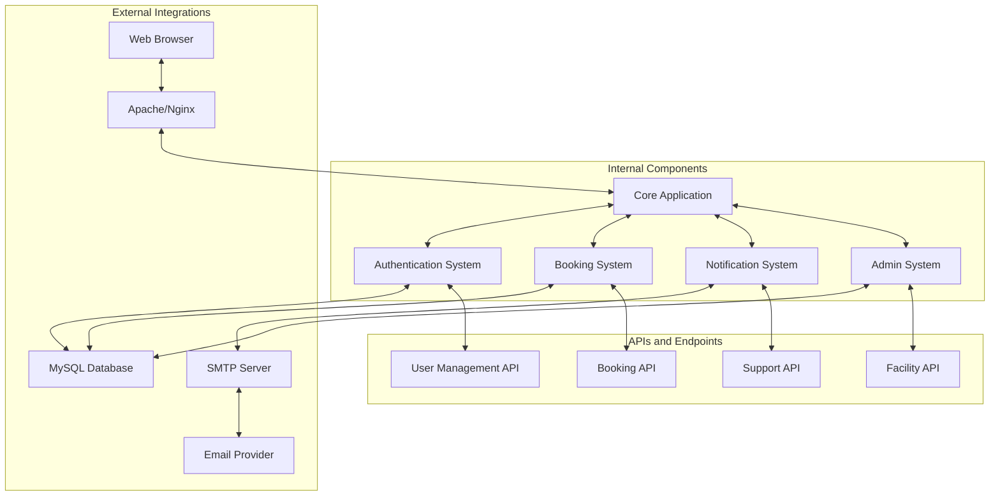
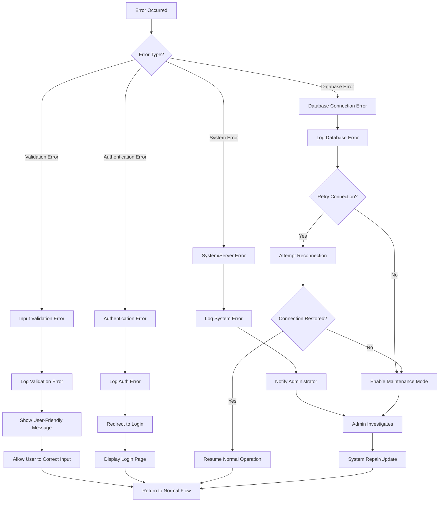
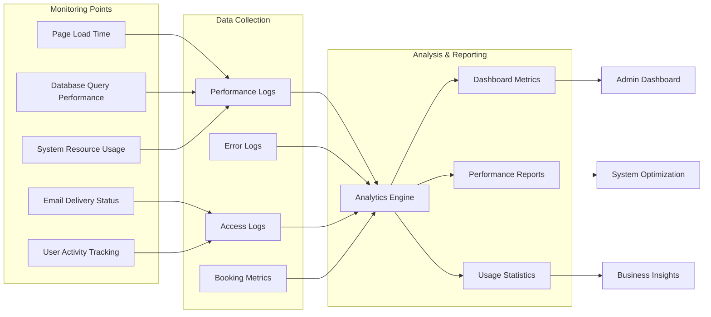

# School Facility Booking System - System Flow Diagram (SFD)

## Overview
This document presents the comprehensive System Flow Diagram for the School Facility Booking System (SFB), illustrating the complete system architecture, user interactions, data flows, and business processes.

## 1. High-Level System Architecture

## 2. User Role-Based System Flow

## 3. Booking Process Flow

## 4. Data Flow Diagram

## 5. Database Entity Relationship Flow

## 6. Security and Authentication Flow

## 7. Email Notification Flow

## 8. System Integration Points

## 9. Error Handling and Recovery Flow

## 10. Performance and Monitoring Flow

## Conclusion

This System Flow Diagram provides a comprehensive view of the School Facility Booking System architecture, covering:

1. **High-level system architecture** showing all major components
2. **User role-based flows** for different user types (Admin, Faculty, Staff)
3. **Detailed booking process flow** with sequence diagrams
4. **Data flow patterns** throughout the system
5. **Database relationships** and entity interactions
6. **Security and authentication mechanisms**
7. **Email notification workflows**
8. **System integration points**
9. **Error handling and recovery procedures**
10. **Performance monitoring and analytics**

The diagrams use Mermaid syntax for easy rendering and maintenance, providing both technical details for developers and high-level overviews for stakeholders.